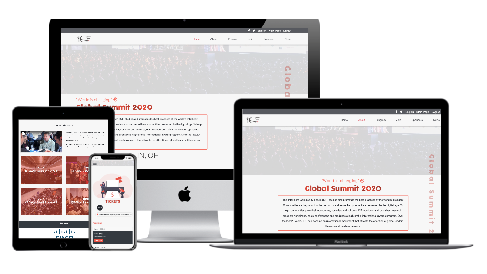

# HTML/CSS Capstone: COP26 UN Climate Conference

> This project is a website for the ICF Global Conference taking place in Dublin, Ohio, USA in October 2020.

I was given [this design](https://www.behance.net/gallery/29845175/CC-Global-Summit-2015) of [Cindy Shin](https://www.behance.net/gallery/29845175/CC-Global-Summit-2015)'s to follow, mirroring its structure, typography and colors as I built my own conference website.

## Video Presentation

Watch my video [presentation]() of the project to hear more about this assignment and how I approached it.

## Built With

- HTML/CSS
- Bootstrap
- CSS
- fontawesome
- npm
- Google Fonts (Lato)
- Stylelint, Webhint, Lighthouse
- VSCode (with Prettier, Stylelint)
- Google Chrome (with DevTools and Pesticide)
- MacOS

## Live Demo

See the project in action by visiting the [live demo](https://wonderful-lichterman-cecf3b.netlify.app)!

## Getting Started

**To get this project set up on your local machine, follow these simple steps:**

1. Open Terminal.

2. Navigate to your desired location to download the contents of this repository.

3. Copy and paste the following code into the Terminal:

    git clone git@github.com:Amita-Roy/global-summit-2020.git

4. Hit enter.

5. Run npm install in the terminal to get all the dependencies installed localy.

6. Once the repository has been cloned, open main.html in a browser of your choosing. From there, you may also navigate to the "Home", "About" and "Join" (Join tab for Ticket page) pages.

7. Enjoy!

### Prerequisites

- A computer, a smartphone, or another similar device.
- Access to the internet.

## Author

👤 **Amita Roy**

> Hello, World! 

> My name's Joe. Hire me!

- Github: [@Amita-Roy](https://github.com/Amita-Roy)
- Twitter: [@AmitaRoy14](https://twitter.com/AmitaRoy14)
- LinkedIn: [Amita Roy](https://www.linkedin.com/in/amita-roy-3b823b68/)

## 🤝 Contributing

Contributions, issues and feature requests are always welcome!

I love meeting other developers, especially ones that give me advice on how to improve my work.

Drop me an [issue](https://github.com/Amita-Roy/global-summit-2020/issues/new)!

## Show your support

Finally, if you've read this far, don't forget to give this repo a ⭐️. They're free . . . I think.

## Acknowledgments

- Thanks are owed to the designer, [Cindy Shin](https://www.behance.net/gallery/29845175/CC-Global-Summit-2015), for design.
- Thanks to [techsini.com](https://techsini.com/multi-mockup/) for their useful URL-based website mockup tool.

- Content was largely inspired by [this](https://www.intelligentcommunity.org/summit_2020_speakers) website, which lists speakers at the ICF in Dublin, Ohio on the 21st-23rd October 2020.

- README Content has been taken from [Joe Burke](https://github.com/Joseph-Burke), one of my stand up team member.

- Icons were taken from https://fontawesome.com/

- Conference images were taken from https://unsplash.com/

- Photo by <a href="https://unsplash.com/@productschool?utm_source=unsplash&amp;utm_medium=referral&amp;utm_content=creditCopyText">Product School</a> on <a href="https://unsplash.com/s/photos/conference?utm_source=unsplash&amp;utm_medium=referral&amp;utm_content=creditCopyText">Unsplash</a>

- Photo by <a href="https://unsplash.com/@productschool?utm_source=unsplash&amp;utm_medium=referral&amp;utm_content=creditCopyText">Product School</a> on <a href="https://unsplash.com/s/photos/conference?utm_source=unsplash&amp;utm_medium=referral&amp;utm_content=creditCopyText">Unsplash</a>

- Photo by <a href="https://unsplash.com/@purzlbaum?utm_source=unsplash&amp;utm_medium=referral&amp;utm_content=creditCopyText">🇨🇭 Claudio Schwarz | @purzlbaum</a> on <a href="https://unsplash.com/s/photos/conference?utm_source=unsplash&amp;utm_medium=referral&amp;utm_content=creditCopyText">Unsplash</a>

## 📝 License

This project is [MIT](lic.url) licensed.